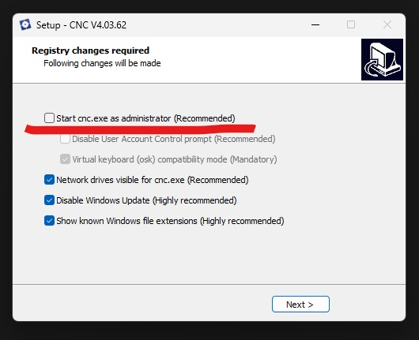
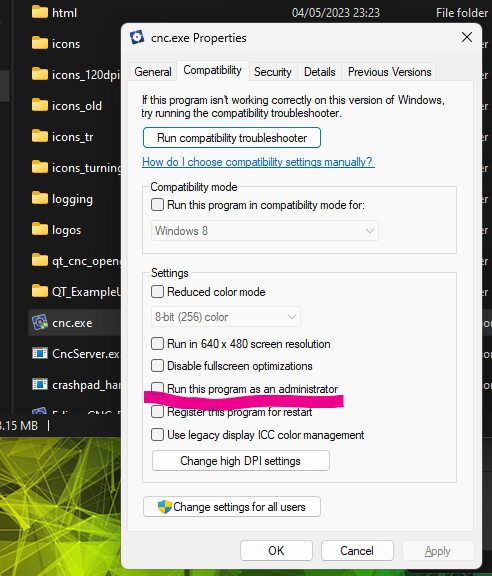

# ControlEdingCNC

## EdingCNCの設定変更
### 1. インストール
EdingCNCは、管理者権限で実行すると外部プログラムからのキーストロークを受け付けなくなる。\
インストール時に「Start cnc.exe as administrator (Recommended)」のチェックを外しておく。\
\
それでも解決しない場合、cnc.exeのプロパティを開いて、「Run this program as an administrator」のチェックを外してから実行する。\

### 2. スタート画面
EdingCNC起動時の画面にスタートボタンがあり、バッチファイルから起動した場合に自動でクリックさせるのが難しいので、
C:\CNC4.03\htmlにある「Start.htm」を開き、自動で画面遷移するように変更する。
\
当該部分はこのリンク(「Agree」などで検索すると出てくる)。

```html
  <a href="app:Agree">
    <span style='font-family:"Arial",sans-serif;mso-no-proof:yes;text-decoration:none;
    text-underline:none'>
    </span>
  </a>
```
これを以下に置換。

```html
  <form action="app:Agree" name="openlink">
    <input type="submit">
  </form>
```
このボタンが含まれているtableの後に以下を追加。

```js
  <script>
    document.openlink.submit();
  </script>
  ```
