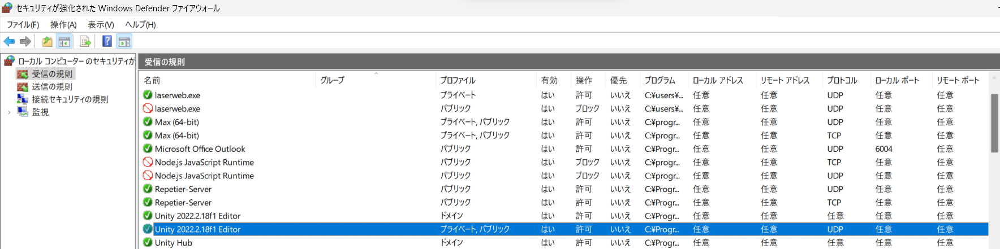

# ControlEdingCNC

## EdingCNCの設定変更
### 1. インストール
EdingCNCは、管理者権限で実行すると外部プログラムからのキーストロークを受け付けなくなる。\
インストール時に「Start cnc.exe as administrator (Recommended)」のチェックを外しておく。\
\
それでも解決しない場合、cnc.exeのプロパティを開いて、「Run this program as an administrator」のチェックを外してから実行する。\

### 2. スタート画面
EdingCNC起動時の画面にスタートボタンがあり、バッチファイルから起動した場合に自動でクリックさせるのが難しいので、
C:\CNC4.03\htmlにある「Start.htm」を開き、自動で画面遷移するように変更する(追記:プロパティ2ページ目の「起動時に確認画面を表示する」のチェックを外せば無効化できるかも？)。\
当該部分はこのリンク(「Agree」などで検索すると出てくる)。

```html
  <a href="app:Agree">
    <span style='font-family:"Arial",sans-serif;mso-no-proof:yes;text-decoration:none;
    text-underline:none'>
    </span>
  </a>
```
これを以下に置換。

```html
  <form action="app:Agree" name="openlink">
    <input type="submit">
  </form>
```
このボタンが含まれているtableの後に以下を追加。

```js
  <script>
    document.openlink.submit();
  </script>
  ```

## OSCトラブルシューティング
OSCは今回結局使用しなかったが、受信できないときはファイアウォールの設定を疑う。\
「Firewall」で検索して「セキュリティが強化された Windows Defender ファイアウォール」→「受信の規制」を開く。\
使用するヴァージョンのエディタのプロパティを開き、必要項目を以下の通り設定。
- プロファイル: パブリック
- 操作: 許可
- プロトコル: UDP
\
それでもうまくいかない場合、この画面で項目ごといったん削除し、HUBからエディターをインストールし直す、新しくプロジェクトを作るなどして、最初のダイアログで「パブリック ネットワーク(空港、喫茶店など)(非推奨)」にチェックを入れて「アクセスを許可する」ことで解決。

## 展示の設定
起動したいアプリとバッチファイルは同じフォルダに格納。\
「cnc.exe」が入っているC:\CNC4.3.62\に、Unityアプリとバッチファイルを保存。
```
@echo off
start \subfolder\ControlEdingCNC.exe
powershell sleep 60
start cnc.exe
```

「shell:startup」でスタートアップフォルダを開き、バッチファイルのショートカットを格納。\
サインイン時にChrome Remote Desktopを起動するよう設定 (ブラウザでGoogleアカウントにログインした状態を維持しておく)。ショートカットが自動的に上記フォルダに格納される。\
ついでに、モスキート音を消すためのホワイトノイズを再生する音声ファイルを上記フォルダに追加。ループ時に途切れるので、次にやるならMaxでパッチ組んだほうが良さげ。\
展示用にゲストユーザを作成、パスワード不要にして自動サインイン出来るように設定。\
スリープと画面オフを無効化。\
「taskschd.msc」でタスクスケジューラを開き、シャットダウン時刻を設定。オプションに「-r -f」を入れて再起動にする。\
~~BIOSで起動時刻を設定。~~
